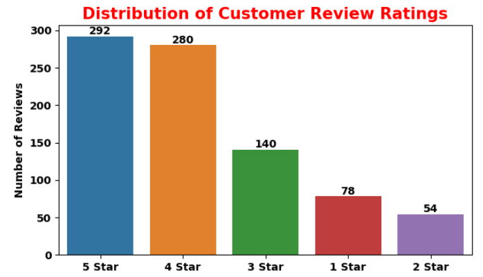
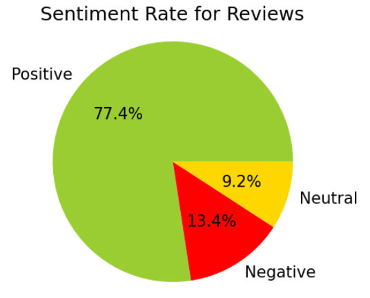
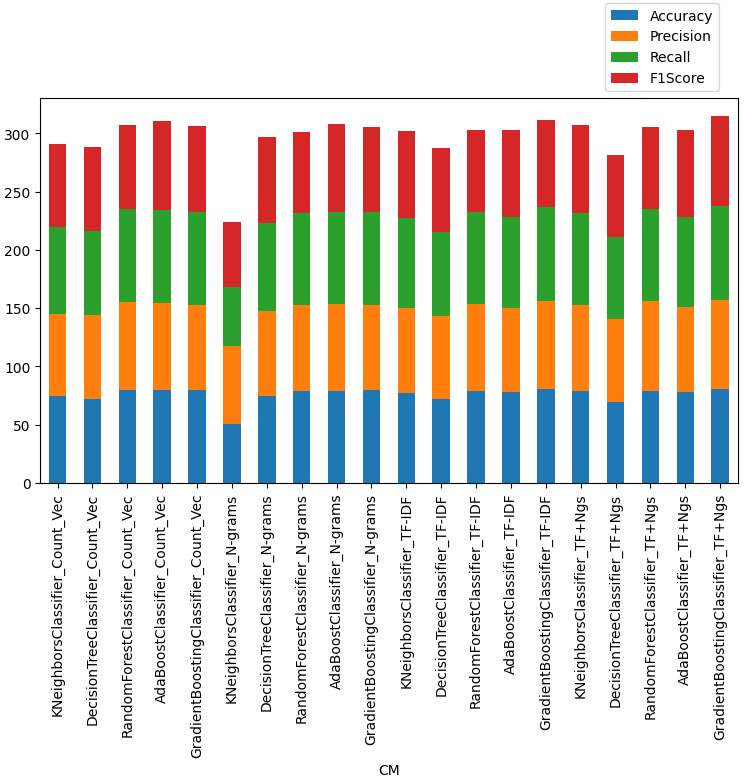
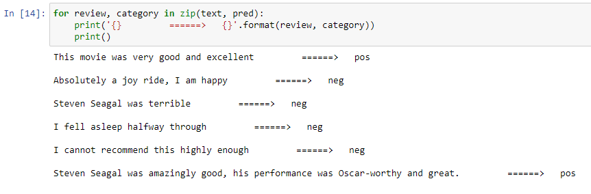
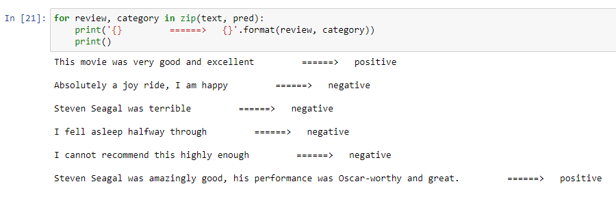

# Sentiment Analysis

Sentiment Analysis, also known as opinion mining, is a natural language processing (NLP) task that involves identifying and extracting subjective information from text. It aims to determine the sentiment expressed in a piece of text, whether it is positive, negative, or neutral. This is widely used in various applications to understand public opinion, enhance customer experience, and improve decision-making processes.

---

## What is Sentiment Analysis?

Sentiment analysis involves parsing text data to determine the emotional tone behind the words. This type of analysis can be applied to social media posts, customer reviews, news articles, and more to assess the sentiments expressed. It is valuable for businesses to monitor customer feedback, brands to track public perception, and organizations to gain insights into public opinion.

### Key Objectives of Sentiment Analysis:
- **Classifying** text as positive, negative, or neutral.
- **Detecting** emotions such as joy, anger, surprise, or sadness.
- **Analyzing** the subjectivity of the content to distinguish between factual information and personal opinions.

---

## How Sentiment Analysis Works

### 1. **Text Preprocessing**
   - **Tokenization**: Splitting the text into words or phrases.
   - **Stop-word Removal**: Eliminating common words like "and," "is," "in," which don’t contribute to sentiment.
   - **Normalization**: Lowercasing, stemming, or lemmatization to standardize words.
   - **Noise Removal**: Removing special characters, numbers, and punctuation.

### 2. **Feature Extraction**
   - **Bag of Words (BoW)**: Represents text as a set of words and their frequencies.
   - **Term Frequency-Inverse Document Frequency (TF-IDF)**: Weighs words by their importance across a set of documents.
   - **Word Embeddings**: Pre-trained embeddings such as **Word2Vec**, **GloVe**, or **FastText** that represent words as vectors in a continuous space.
   - **Contextual Embeddings**: Advanced embeddings from models like **BERT** or **GPT**, which capture context within sentences.

### 3. **Modeling Approaches**
   - **Traditional Machine Learning Models**:
     - **Logistic Regression**
     - **Naive Bayes Classifier**
     - **Support Vector Machines (SVMs)**
     - **Random Forests**
   - **Deep Learning Models**:
     - **Recurrent Neural Networks (RNNs)**, including **LSTM** and **GRU**, are good for sequential data like text.
     - **Convolutional Neural Networks (CNNs)**, which can be used to extract local patterns in text.
     - **Transformers**, such as **BERT** (Bidirectional Encoder Representations from Transformers) and **GPT** (Generative Pre-trained Transformer), are the state-of-the-art for handling complex NLP tasks.

### 4. **Sentiment Analysis Techniques**
   - **Lexicon-Based Methods**: Use dictionaries of words associated with positive or negative sentiment. Examples include **SentiWordNet** and **VADER**.
   - **Machine Learning-Based Approaches**: Train a model on a labeled dataset (e.g., movie reviews, tweets) to learn the patterns of sentiment.
   - **Hybrid Methods**: Combine lexicon-based and machine learning methods to improve accuracy.

